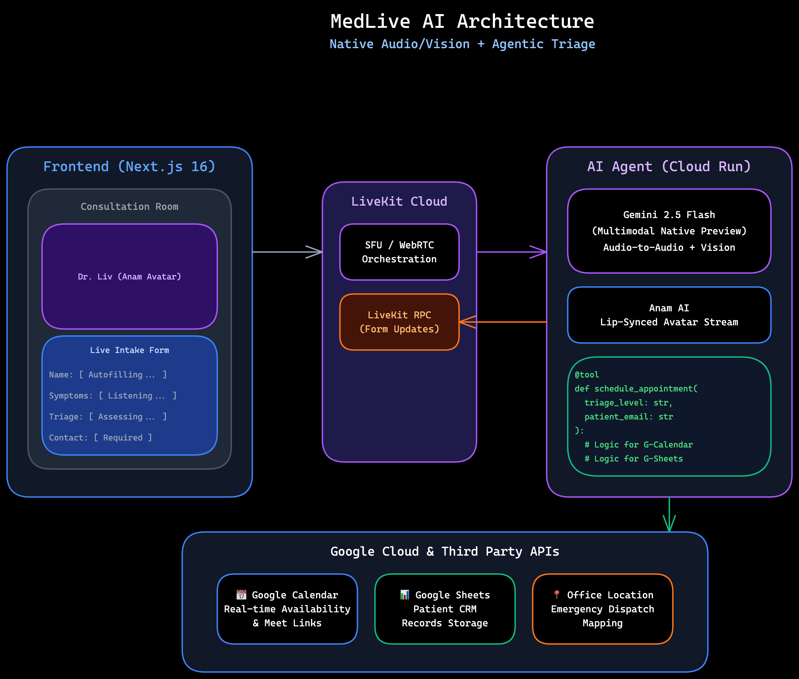

# MedLive AI

**Your personal AI health assistant that listens to your concerns, sees your symptoms, fills out your medical forms automatically, guides you to the right care, and connects you with a doctor - all through a simple video conversation.**

[](https://medlive-frontend-272299131014.europe-west1.run.app)
[](https://geminiliveagentchallenge.devpost.com/)

---



---

## Live Demo

**Try it now:** [https://medlive-frontend-272299131014.europe-west1.run.app](https://medlive-frontend-272299131014.europe-west1.run.app)

> Click "Start Consultation" and talk to Dr. Liv - your AI medical triage assistant!

---

## The Problem

It's 11 PM. Your child has developed a strange rash. You're worried, but not sure what to do:

- *Is this an allergic reaction? Should I rush to the ER?*
- *Can this wait until morning?*
- *The nurse hotline has a 45-minute wait...*

**What if you could just... talk to someone? Right now?**

Someone who would listen, ask the right questions, actually *look* at the rash through your camera, tell you whether you need emergency care, and **book you an appointment** - all in under 3 minutes.

**That's MedLive AI.**

---

## What Makes MedLive Different

This isn't a chatbot. This isn't a symptom checker with endless dropdown menus.

MedLive AI is a **live video conversation with Dr. Liv**, an AI medical assistant who:

| Feature | How It Works |
|---------|--------------|
| **Listens naturally** | Just talk - no typing, no menus |
| **Sees symptoms** | Show your camera, AI analyzes what it sees |
| **Auto-fills forms** | Patient intake form populates as you speak |
| **Triages accurately** | 5-level triage: Emergency → Self-care |
| **Books appointments** | Checks real availability, books on Google Calendar |
| **Saves records** | Everything saved to Google Sheets for clinic staff |

---

## Tech Stack

| Layer | Technology | Purpose |
|-------|------------|---------|
| **AI Model** | Gemini 2.5 Flash (Native Audio + Vision) | Real-time voice + live video for visual symptom analysis |
| **Avatar** | Anam AI | Lifelike Dr. Liv with lip-synced responses |
| **Realtime** | LiveKit Cloud + Agents SDK | WebRTC, audio/video streaming, agent framework |
| **Frontend** | Next.js 16 + React 19 | Patient consultation UI |
| **Backend** | Python + LiveKit Agents | AI agent logic, tool calls |
| **Database** | Google Sheets | Patient records CRM |
| **Scheduling** | Google Calendar API | Real-time appointment booking |
| **Hosting** | Google Cloud Run | Serverless container deployment |
| **Secrets** | GCP Secret Manager | API keys and credentials |

---

## Features

### AI Agent Capabilities

| Capability | Implementation |
|------------|----------------|
| **Native Audio Understanding** | Gemini 2.5 Flash processes speech directly - no STT/TTS latency |
| **Live Video Vision** | Sees patient's camera in real-time for visual symptom assessment (rashes, injuries, swelling) |
| **Lifelike Avatar** | Anam AI provides Dr. Liv with realistic lip-sync and expressions |
| **Function Calling** | 8 custom tools for form filling, triage, booking, and more |
| **Real-time RPC** | LiveKit RPC syncs form fields to frontend instantly |
| **Intelligent Triage** | 5-level assessment based on symptoms and severity |
| **Calendar Integration** | Checks real availability, books Google Calendar events |
| **Google Meet Links** | Auto-generates Meet links for virtual consultations |
| **Conversational Fillers** | Natural speech like "Let me check appointments..." while processing |

### Agent Tools (Function Calling)

```python
@function_tool
async def save_patient_info(...)      # Save name, age, contact, complaint
async def update_field(...)           # Update individual form fields via RPC
async def assess_triage(...)          # 5-level triage assessment
async def check_available_slots(...)  # Query Google Calendar availability
async def schedule_appointment(...)   # Book on Google Calendar + Meet link
async def request_callback(...)       # Request clinic callback
async def submit_to_sheets(...)       # Save record to Google Sheets CRM
async def end_session(...)            # Gracefully close consultation
```

### Triage Levels

| Level | Criteria | Action |
|-------|----------|--------|
| **EMERGENCY** | Chest pain, stroke symptoms, severe bleeding | In-person immediately |
| **URGENT** | High fever, fractures, head injury | In-person within hours |
| **SEMI-URGENT** | Moderate symptoms, needs attention | Appointment within 24h |
| **ROUTINE** | Non-urgent, can be scheduled | Virtual consultation |
| **SELF-CARE** | Minor issues, home treatment | Guidance provided |

### For Patients
- **Voice-first interaction** - Just talk, no typing
- **Real-time form filling** - Watch your intake form populate as you speak
- **5-level triage** - Emergency, Urgent, Semi-Urgent, Routine, Self-Care
- **Instant booking** - Check availability and book appointments by voice
- **24/7 availability** - AI assistant available anytime

### For Clinics
- **Google Sheets CRM** - Patient cases appear in real-time
- **Reduced call volume** - AI handles first-contact screening
- **Better documentation** - Complete records with triage assessment
- **Calendar integration** - Appointments sync to Google Calendar

---

## Project Structure

```
medlive-ai/
├── agent/                    # Python AI agent
│   ├── src/
│   │   ├── agent.py         # Main agent logic (Dr. Liv)
│   │   └── calendar_service.py  # Google Calendar integration
│   ├── Dockerfile           # Cloud Run container
│   └── pyproject.toml       # Python dependencies
├── frontend/                 # Next.js frontend
│   ├── src/app/
│   │   ├── page.tsx         # Landing page
│   │   ├── consultation/    # Consultation room
│   │   ├── doctor/          # Doctor dashboard
│   │   └── api/token/       # LiveKit token API
│   └── Dockerfile           # Cloud Run container
├── deploy.sh                 # Deployment script
└── .env.example             # Environment template
```

---

## Quick Start (Local Development)

### Prerequisites
- Python 3.11+
- Node.js 20+
- [uv](https://docs.astral.sh/uv/) (Python package manager)
- [pnpm](https://pnpm.io/) (Node.js package manager)

### 1. Clone & Configure

```bash
git clone https://github.com/MrJohn91/medlive-ai.git
cd medlive-ai
cp .env.example .env.local
```

Edit `.env.local` with your API keys:
```env
LIVEKIT_URL=wss://your-project.livekit.cloud
LIVEKIT_API_KEY=your_key
LIVEKIT_API_SECRET=your_secret
GOOGLE_API_KEY=your_gemini_key
ANAM_API_KEY=your_anam_key
GOOGLE_SHEET_ID=your_sheet_id
GOOGLE_SHEET_NAME=Sheet1
```

### 2. Run the Agent

```bash
cd agent
uv sync
uv run python -m src.agent dev
```

### 3. Run the Frontend

```bash
cd frontend
pnpm install
pnpm dev
```

Open [http://localhost:3000](http://localhost:3000)

---

## Deployment (Google Cloud Run)

### Prerequisites
- Google Cloud account with billing enabled
- `gcloud` CLI installed and authenticated
- APIs enabled: Cloud Run, Secret Manager, Sheets, Calendar

### Deploy

```bash
# Set your project
gcloud config set project YOUR_PROJECT_ID

# Create secrets
gcloud secrets create LIVEKIT_URL --data-file=- <<< "wss://your.livekit.cloud"
gcloud secrets create LIVEKIT_API_KEY --data-file=- <<< "your_key"
gcloud secrets create LIVEKIT_API_SECRET --data-file=- <<< "your_secret"
gcloud secrets create GOOGLE_API_KEY --data-file=- <<< "your_gemini_key"
gcloud secrets create ANAM_API_KEY --data-file=- <<< "your_anam_key"
gcloud secrets create GOOGLE_SHEET_ID --data-file=- <<< "your_sheet_id"
gcloud secrets create GOOGLE_SHEET_NAME --data-file=- <<< "Sheet1"

# Deploy agent
cd agent
gcloud builds submit --tag gcr.io/YOUR_PROJECT_ID/medlive-agent
gcloud run deploy medlive-agent \
  --image gcr.io/YOUR_PROJECT_ID/medlive-agent \
  --region europe-west1 \
  --allow-unauthenticated \
  --set-secrets="LIVEKIT_URL=LIVEKIT_URL:latest,..." \
  --memory 2Gi --cpu 2 --min-instances 1

# Deploy frontend
cd ../frontend
gcloud builds submit --tag gcr.io/YOUR_PROJECT_ID/medlive-frontend
gcloud run deploy medlive-frontend \
  --image gcr.io/YOUR_PROJECT_ID/medlive-frontend \
  --region europe-west1 \
  --allow-unauthenticated \
  --set-secrets="LIVEKIT_API_KEY=LIVEKIT_API_KEY:latest,..."
```

---

## API Keys Required

| Service | Get Key From |
|---------|--------------|
| LiveKit | [cloud.livekit.io](https://cloud.livekit.io) |
| Gemini | [aistudio.google.com](https://aistudio.google.com/apikey) |
| Anam | [lab.anam.ai](https://lab.anam.ai/api-keys) |
| Google Sheets | Enable Sheets API in GCP Console |
| Google Calendar | Enable Calendar API in GCP Console |

---

## Hackathon Submission

**Competition:** [Gemini Live Agent Challenge](https://geminiliveagentchallenge.devpost.com/)

### Why MedLive AI Should Win

1. **Truly Multimodal** - Voice + Vision + Real-time actions (form filling, booking)
2. **End-to-End Solution** - From symptom description to booked appointment in one conversation
3. **Solves Real Problems** - Healthcare access, triage efficiency, appointment friction
4. **Full GCP Integration** - Cloud Run, Gemini, Calendar, Sheets, Secret Manager
5. **Production Ready** - Live demo deployed and functional

### Google Products Used
- Google Gemini 2.5 Flash (Native Audio)
- Google Cloud Run
- Google Calendar API
- Google Sheets API
- GCP Secret Manager

---

## Demo Video

[Coming Soon]

---

## Team

Built with love for the Gemini Live Agent Challenge 2026.

---

## License

MIT
